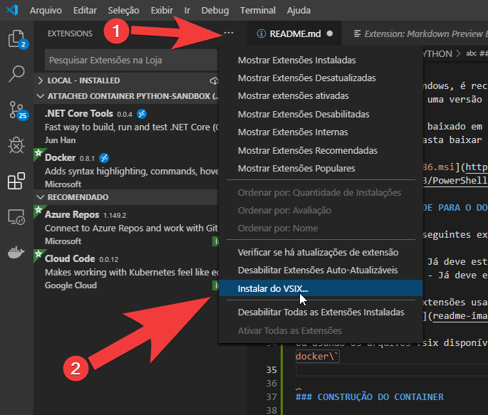

# ESTUDANDO PYTHON

O intuito desse projeto é permitir que o estudante possa configurar rapidamente um ambiente de estudo para o Python com o Docker, sem precisar instalar o python e outras ferramentas localmente.

As únicas ferramentas que ele vai precisar instalar localmente são o VS CODE e o Docker.

## INSTALAÇÃO DO AMBIENTE

### DOCKER

Baixe e instale o Docker. No windows, ele pode ser baixado em <https://www.docker.com/products/docker-desktop>

### VISUAL STUDIO CODE

Baixe e instale o VS Code. Ele pode ser baixado em <https://code.visualstudio.com/>

### O SHELL NO WINDOWS

Se você é usuário do Windows, é recomendável que instale o Powershell 6 ou versão mais atual, caso uma versão estável já esteja disponível.

O powershell 6 pode ser baixado em <https://github.com/PowerShell/PowerShell/releases/tag/v6.2.3>. Basta baixar o pacote MSI e instalar. Exemplo:

[PowerShell-6.2.3-win-x86.msi](https://github.com/PowerShell/PowerShell/releases/download/v6.2.3/PowerShell-6.2.3-win-x86.msi)

### CONFIGURANDO O VSCODE PARA O DOCKER

Instale, no VSCode, as seguintes extensões:

- Remote - Containers
- Docker Extension Pack

Você pode instalar as extensões usando o a Loja de extensões (`Ctrl + Shift + X`) 

Ou usando os arquivos vsix disponíveis na pasta `utils/extensions/step1 - docker` 

### CONSTRUÇÃO DO CONTAINER

Para executar os código Python, iremos usar o docker. Para isso, iremos  construir e executar um container docker.

O primeiro passo é abrir o shell (bash, sh, powershell) e navegar para a pasta do projeto:

```bash
cd D:\projetos\python-learning
```

ou

```bash
cd /home/meu-usuario/python-learning
```

Então, nesse diretório, executar o comando `docker build`

```bash
docker build -t python-sandbox .
```

### EXECUÇÃO DO CONTAINER

Verificar a pasta onde o arquivo Dockerfile está. O caminho dessa pasta deve ser configurado no comando `docker run`, no lugar de `CAMINHO_DA_PASTA_HOST`

```bash
docker run -it -d -v CAMINHO_DA_PASTA_HOST:/home/teste --name python-sandbox python-sandbox
```

#### Exemplo de execução do docker run

O projeto está na pasta `"D:\projetos\python-learning"`

O comando a ser executado será:

```bash
docker run -it -d -v D:\projetos\python-learning:/home/teste --name python-sandbox python-sandbox
```

### CONECTANDO O VISUAL STUDIO CODE AO CONTAINER

Após a instalação do VSCode e a execução do container, o próximo passo é a conexção do VSCode ao container.

Para isso, instale a extensão `Remote - Containers`, no painel de gerenciamento de extenções. Se necessário, recarregue o VSCode.

Abra o painel de comandos (`Ctrl + Shift + P`) e execute o comando `Show Remote Menu` 

Ou

Clique no botão do canto inferior esquerdo. 

Selecione a opção `Attach to Running Container` 

e selecione o container `python-sandbox`. 

Se tudo ocorrer bem, você verá a seguinte tela 

## CONFIGURAÇÃO DO VSCODE

No terminal, no VSCode, selecione o terminal `bash`. 

### CONFIGURANDO O GIT

Para configurar o `git`, execute o comando `git-config`.

```bash
git config --global user.email "you@example.com"
git config --global user.name "Your Name"
```

#### Exemplo de confuguração do git config

```bash
git config --global user.email "josenaldo@gmail.com"
git config --global user.name "Josenaldo de Oliveira Matos Filho"
```

### INSTALANDO O JUPYTER

Antes de instalar os plugins do VSCode, instale o Jupyter e o Notebook. Para isso, execute os comandos:

```bach
pip install jupyter
pip install notebook
```

### CONFIGURANDO O VSCODE PARA O PYTHON

Instale, no VSCode, as seguintes extensões:

- Python
- Python for VSCode
- Python Preview
- Python Snippets
- Python Docs
- Python Coding Conventions

Você pode instalar as extensões usando o a Loja de extensões (`Ctrl + Shift + X`) 

Ou usando os arquivos vsix disponíveis na pasta `utils/extensions/step2 - python`

### OPCIONAL: CONFIGURANDO O VSCODE PARA O MARKDOWN

Caso deseje trabalhar com arquivos markdown (para anotações, documentação, etc.), instale, no VSCode, as seguintes extensões:

- Markdown All in One
- markdownlint
- Markdown Preview Enhanced

Você pode instalar as extensões usando o a Loja de extensões (`Ctrl + Shift + X`) 

Ou usando os arquivos vsix disponíveis na pasta `utils/extensions/step3 - markdown`

### ATUALIZANDO AS EXTENSÕES

Verifique se há atualizações para as extensões instaladas. 

### RECARREGUE a IDE

Se necessário, recarregue o VSCode para concluir a instalação das extensões instaladas. 

Ao fim do processo, o VSCode deve estar mostando o arquivo `python-sandbox.json`com um conteúdo próximo ao exemplo:

```javascript
{
    "extensions": [
        "DavidAnson.vscode-markdownlint",
        "dongli.python-preview",
        "formulahendry.docker-explorer",
        "formulahendry.docker-extension-pack",
        "formulahendry.dotnet",
        "igress.python-coding-conventions",
        "ms-azuretools.vscode-docker",
        "MS-CEINTL.vscode-language-pack-pt-BR",
        "ms-python.python",
        "Mukundan.python-docs",
        "shd101wyy.markdown-preview-enhanced",
        "tht13.python",
        "yzhang.markdown-all-in-one"
    ],
    "workspaceFolder": "/home/teste"
}
```
